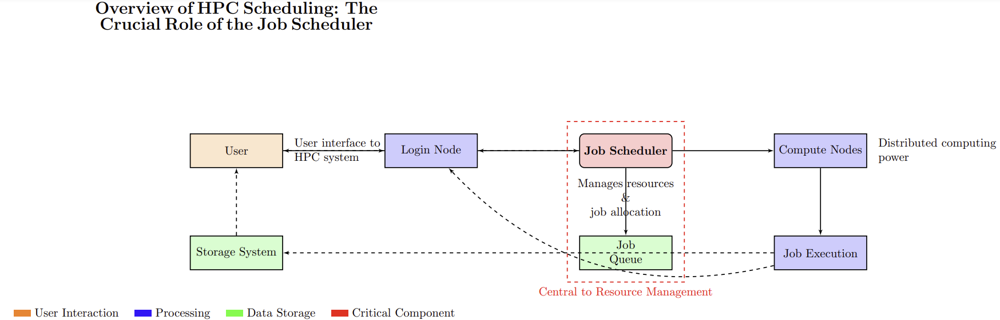
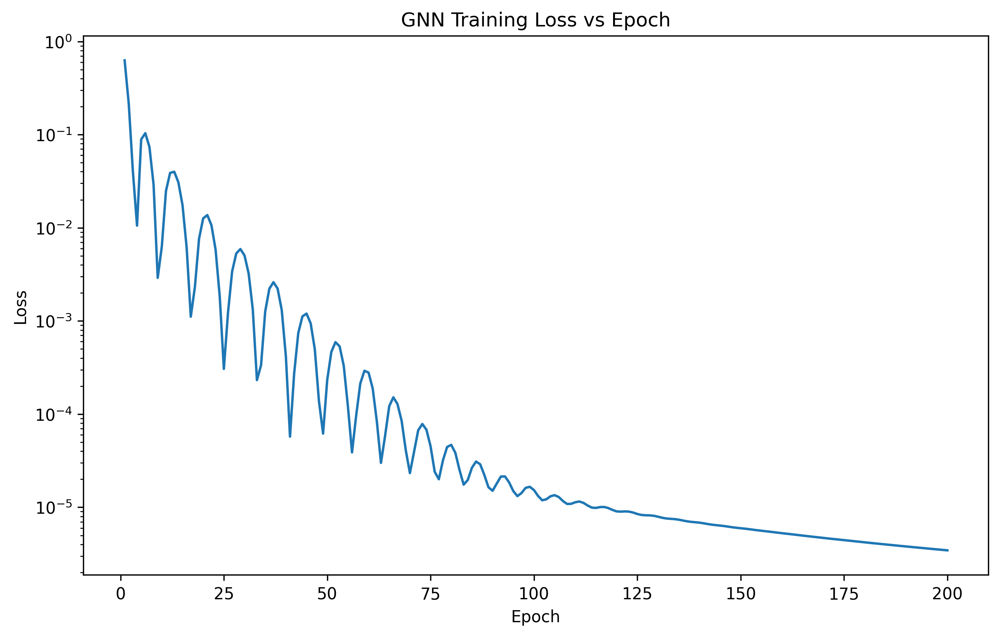
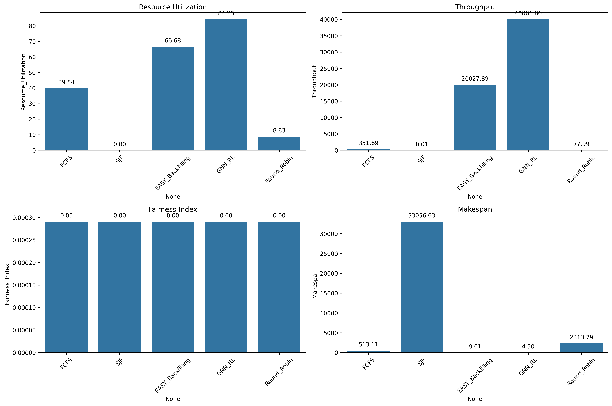

## Presentation Summary

In the ever-evolving landscape of High-Performance Computing (HPC), efficient resource management remains a critical challenge. My presentation introduces a groundbreaking approach to HPC scheduling that harnesses the power of Graph Neural Networks (GNNs) and Reinforcement Learning (RL) to dramatically improve system performance.

## Key Highlights

1. **Unveiling the limitations of traditional scheduling algorithms in modern HPC environments**
2. **Introduction to a novel GNN-RL hybrid model for intelligent, adaptive scheduling**
3. **Demonstration of significant improvements in resource utilization, job throughput, and makespan reduction**
4. **Real-world application using Argonne Leadership Computing Facility workload data**
5. **Future directions in AI-driven HPC optimization**

This research represents a significant leap forward in HPC resource management, promising to accelerate scientific discoveries across various fields, from climate modeling to drug discovery.

## Images/Figures from the Presentation

### Overview of HPC Scheduling

{:.w-75 .normal}

### GNN-RL Convergence Training Loss Analysis

{:.w-75 .normal}

### Comparison of Traditional vs. AI-driven Scheduling Algorithms

{:.w-75 .normal}

## Presenter Bio

{: width="250" height="150" .w-30 .left}

### Kyrian C. Adimora, B.Eng. (Hons), M.Eng.
**Student Member, IEEE & ACM**  
**Ph.D. Candidate, Computer Science**  
**University of Kansas**

#### Research Focus
Kyrian C. Adimora is a Ph.D. candidate in Computer Science at the University of Kansas, specializing in the convergence of High-Performance Computing (HPC) and Artificial Intelligence. Under the mentorship of Dr. Sun Hongyang, his research aims to enhance weather prediction accuracy through AI-optimized HPC systems.

#### Education
- **Ph.D. Candidate**, Computer Science, University of Kansas
- **M.Eng.**, Computer Engineering, Michael Okpara University of Agriculture, Umudike, Nigeria
- **B.Eng. (First Class Honors)**, Computer Engineering, Michael Okpara University of Agriculture, Umudike, Nigeria
- **Postgraduate Diploma**, Information Management Technology, Federal University of Technology, Owerri
- **Higher National Diploma (Distinction)**, Electrical Electronics Engineering, Federal Polytechnics Nekede

#### Professional Experience
- **Lecturer**, Michael Okpara University of Agriculture, Umudike
- **Director of ICT**, Eastern Palm University (now Kingsley Ozumba Mbadiwe University), 2018-2019

#### Research Interests
- High-Performance Computing (HPC)
- Artificial Intelligence (AI)
- Machine Learning
- Cloud Computing
- IoT/Mobile Security

#### Professional Affiliations
- IEEE Computer Society
- Association for Computing Machinery (ACM)
- National Society of Black Engineers (NSBE)
- American Association for the Advancement of Science (AAAS)
- Council for the Regulation of Engineering in Nigeria (COREN)

#### Roles and Responsibilities
- Nominated IEEE Kansas City Education Activity Chair
- Reviewer for multiple high-impact journals in the field

Mr. Adimora's multidisciplinary background and ongoing research at the intersection of HPC and AI position him at the forefront of cutting-edge developments in computer science and engineering.
